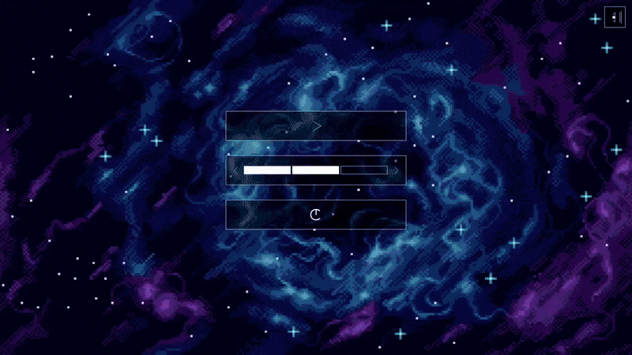

# 🎮 Labyrinthe 2D - Jeu d'Évasion avec IA

Un jeu de labyrinthe procédural en C avec SDL2, mettant en scène des monstres dotés d'intelligence artificielle avancée et des mécaniques de gameplay dynamiques.

<div align="center">
  
  <p><i>Gameplay Example</i></p>
</div>

---

## 🎯 Aperçu du Projet

Jeu d'action-réflexion où le joueur doit collecter des ressources en oxygène tout en échappant à des monstres intelligents dans un labyrinthe généré procéduralement. Le projet démontre une maîtrise des algorithmes de graphes, de l'IA de jeu, et de la programmation système en C.

### ✨ Points Forts Techniques

- **Génération Procédurale** : Algorithme de Kruskal pour créer des labyrinthes uniques à chaque partie
- **IA Multi-États** : Système d'intelligence artificielle avec modes de recherche et de chasse
- **Algorithmes de Pathfinding** : Implémentation de BFS, Dijkstra et A* avec différentes heuristiques
- **Architecture Modulaire** : Code organisé en modules réutilisables (audio, graphiques, core game logic)
- **Animations Fluides** : System d'animation par sprite sheets avec interpolation

---

## 🛠️ Technologies Utilisées

```
C (C99)          │ Langage principal
SDL2             │ Rendu graphique et audio
SDL2_image       │ Gestion des textures PNG
SDL2_mixer       │ Système audio
Make             │ Système de build
```

---

## 🎮 Fonctionnalités

### Gameplay
- ⚡ **Trois niveaux de difficulté** avec paramètres adaptatifs (taille du labyrinthe, nombre de monstres, cooldowns)
- 🎯 **Système de collecte** d'objets avec feedback audio
- 🏃 **Mécanisme de saut** pour franchir les murs (avec cooldown)
- 👾 **Monstres intelligents** avec comportements adaptatifs

### Systèmes Techniques

#### Intelligence Artificielle des Monstres
```
Mode RECHERCHE → Exploration systématique avec frontière
Mode CHASSE    → Poursuite active avec prédiction de trajectoire
```

- Mémoire spatiale limitée simulant l'apprentissage progressif
- Système de pénalité pour éviter la proximité entre monstres
- Détection du joueur basée sur la distance Manhattan

#### Génération de Labyrinthe
- Algorithme de Kruskal avec union-find optimisé
- Création d'arbres couvrants imparfaits pour plus de chemins
- Structures de données efficaces (tas min-heap, files FIFO)

#### Rendu Graphique
- Parallax scrolling multi-couches pour le menu
- Système d'animation avec spritesheets
- Effets visuels (zones de détection, heatmaps)
- Interface adaptative au plein écran

---

## 📁 Architecture du Projet

```
.
├── src/
│   ├── core/          # Logique du jeu et algorithmes
│   │   ├── jeu.c      # Boucle principale, IA des monstres
│   │   ├── laby.c     # Génération et pathfinding
│   │   └── structures.c  # Files, tas, AVL
│   ├── graphics/      # Rendu SDL
│   │   ├── labySDL.c  # Affichage du labyrinthe
│   │   └── effetSDL.c # Transformations (zoom, rotation)
│   ├── audio/         # Gestion audio
│   └── ui/            # Interface utilisateur
├── include/           # Headers (.h)
├── assets/            # Ressources (sprites, sons, musiques)
└── Makefile          # Compilation automatisée
```

---

## 🚀 Installation et Compilation

### Prérequis
```bash
# Ubuntu/Debian
sudo apt-get install libsdl2-dev libsdl2-image-dev libsdl2-mixer-dev libsdl2-ttf-dev libsdl2-gfx-dev

# Arch Linux
sudo pacman -S sdl2 sdl2_image sdl2_mixer sdl2_ttf sdl2_gfx
```

### Compilation
```bash
# Cloner le dépôt
git clone https://github.com/H-raf0/jeu-de-labyrinthe-2d.git
cd jeu-de-labyrinthe-2d

# Compiler
make

# Lancer le jeu
./exec
```

### Nettoyage
```bash
make clean  # Supprime les fichiers objets et l'exécutable
```

---

## 🎮 Comment Jouer

### Contrôles
- **Flèches directionnelles** : Déplacement
- **Espace** : Saut par-dessus un mur (si cooldown disponible)
- **Échap** : Retour au menu / Quitter

### Objectif
Collecter tous les objets O₂ (oxygène) sans se faire attraper par les monstres !

### Indicateurs Visuels
- 🟢 **Cercle vert** : Saut disponible
- 🔴 **Cercle rouge** : Saut en recharge
- 🔴 **Zone rouge** : Rayon de détection des monstres en mode chasse
- 👾 **Monstres rouges** : En mode chasse active

---

## 🧠 Algorithmes Implémentés

### Pathfinding
| Algorithme | Cas d'usage | Complexité |
|------------|-------------|------------|
| **BFS** | Recherche de plus court chemin (coût uniforme) | O(V + E) |
| **Dijkstra** | Graphes pondérés (coûts variables) | O((V + E) log V) |
| **A*** | Recherche heuristique optimisée | O(b^d) avec heuristique admissible |

### Heuristiques A*
- **Manhattan** : Idéale pour grilles (mouvements 4 directions)
- **Euclidienne** : Distance réelle
- **Tchebychev** : Mouvements diagonaux

---

## 💡 Compétences Démontrées

### Programmation
- ✅ Maîtrise du C et gestion mémoire manuelle
- ✅ Architecture logicielle modulaire et maintenable
- ✅ Programmation événementielle (SDL)
- ✅ Optimisation des performances (calculs en temps réel)

### Algorithmique
- ✅ Théorie des graphes et algorithmes de recherche
- ✅ Intelligence artificielle de jeu (FSM, pathfinding)
- ✅ Génération procédurale de contenu

### Ingénierie
- ✅ Gestion de projet complexe multi-modules
- ✅ Système de build avec Makefile
- ✅ Débogage et profilage de code C

---

## 📝 Licence

Projet académique - Faites ce que vous voulez avec ce projet.

---

## 👤 Auteur

**zidane**
- 📧 dhimenzidane@gmail.com
- 💼 [linkedin.com/in/zidane-dhimen](https://fr.linkedin.com/in/zidane-dhimen/)
- 🐱 [github.com/Dhimen-z](https://github.com/Dhimen-z)
